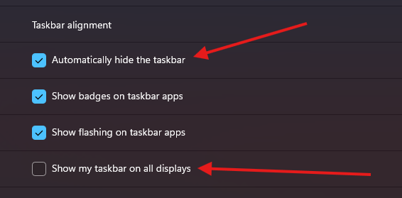

# Simple Python Dock


# Important: Hide OS Taskbar 

- Automatically hide the taskbar: Enabled
- Show my taskbar on all displays: Disabled
- In ```main.py``` set ```HIDE_TASKBAR = True```




# How to Add Apps or Links in Dock

Open config.json and edit the list or add new entries.

Example of an App
```
	"Arc Browser": {
		"icon": "./icons/svg/arc.svg",
		"type": "open_app",
		"exec": "Arc.exe"
	}
```

Example of a Link
```
	"YouTube": {
		"icon": "./icons/svg/youtube.svg",
		"type": "open_url",
		"url": "https://www.youtube.com"
	}
```

Type can be ```open_app``` or ```open_url```


# How to run
Clone this repository and run ```pip install -r requirements.txt```, run dock ```python .\main.py```